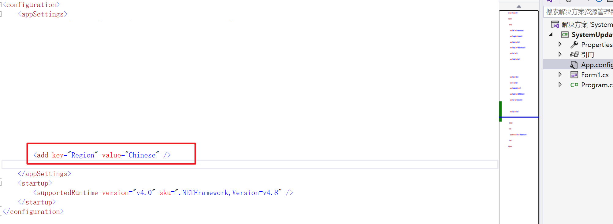
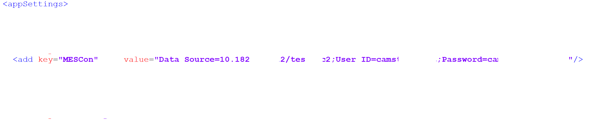
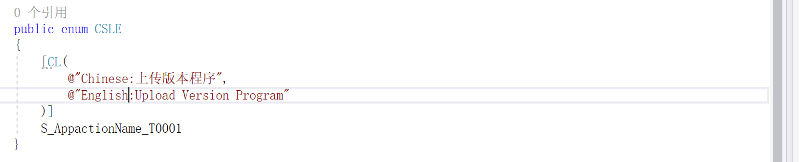

# CSL双语系扩展类库使用SOP手册


# 工具类库介绍

## 1.1 说明 

​		.Net CSL双语系类库（以下简称：CSL）是一款强大的双语内容处理工具，旨在满足多语言应用程序的翻译和本地化需求。其主要特点包括：

​		独立性：不依赖外部网络或第三方翻译服务，使您的应用程序在没有互联网连接的情况下也能正常工作。

​		易于部署和切换：CSL双语系类库提供简单而灵活的部署选项，允许您轻松切换语言设置，无需复杂的配置或重新编译应用。

​		开发者友好：CSL双语系类库设计得非常开发者友好，提供清晰的API和文档，使开发者能够轻松地集成和使用它，无需耗费大量时间和精力。

​		动态消息内容：您可以在运行时动态更改消息内容，从而实现实时的本地化和个性化用户体验，无需重新启动应用程序。

​		这个类库是构建多语言应用程序的理想选择，使开发人员能够更轻松地创建全球化的软件，同时确保用户获得无缝的多语言体验。无论您是开发桌面应用程序、移动应用程序还是Web应用程序，CSL双语系类库都能满足您的多语言需求，提供高度可定制的解决方案，图1.1.1。从图中的逻辑可以看出多语系实现方式是通过在项目本地新建一个CLES枚举类，该类中存储着对应Key及key对应语言环境Value，图1.1.2；程序在调用CSL对应方法读取CLES对应Key及其对应语言环境下的Value；读取到Value并相应给调用处。


<p style="text-align:center">图 1.1.1 双语系（多语系）业务执行逻辑</p>


<p style="text-align:center">图 1.1.2 CLES枚举类规范</p>

​		CSL双语系类库不仅具备上述核心特点，还提供了一系列附加功能，以进一步增强多语言应用程序的便捷性和实用性。其中性能优化，CSL双语系类库经过优化，具备卓越的性能，确保快速响应用户切换语言或动态内容的需求。

​		总之，CSL双语系类库是一个全面的多语言解决方案，旨在让开发人员在不依赖外部服务、方便部署和切换、易于使用且动态本地化的环境下，打造全球化的应用程序。无论您的应用程序规模如何，CSL都能满足您的多语言需求，为用户提供出色的本地化体验，促进全球市场的扩展和增长。

## 1.2 依赖Oracle.ManagedDataAccess【可选】 

> 是否添加对应的【Oracle.ManagedDataAccess】外部访问Orcale数据驱动依赖是可选。

​		如果需要配合西门子Camstar系统中的【UserLabel】与【Dictionary】这两个功能模块完成多语言数据存储与备份，使用CSL就需要项目中添加【Oracle.ManagedDataAccess】依赖dll，除了依赖还需要在Web.config（App.Config）配置文件中添加对应数据库连接字符串，图1.1.3中第一个红框；第二项配置为当前语言环境，第二红框。


<p style="text-align:center">图 1.1.3 外挂Camstar数据库配置</p>

​		如果只是在项目中使用双语系（多语系）功能并且不外挂Camstar及其其他系统，就不需要添加其他外部依赖dll，只需要添加CSL.dll一个依赖即可。添加对应依赖后也必须要在Web.Config（App.Config）中添加语言环境配置，图1.1.3第二红框部分。


# 第2章 添加CSL依赖

## 2.1 创建项目 

​		测试CSL类库，可以新建一个【Winform】项目，通过在项目中引入CSL类库即可使用该类库提供的方法，图2.1.1：


<p style="text-align:center">图 2.1.1 新建Winform项目</p>

## 2.2 添加CSL相关依赖 

​		①打开项目根目录添加新目录Lib，该目录用于类库Dll存放，图2.1.2；


<p style="text-align:center">图 2.1.2 新建lib目录</p>

​		②复制CSL类库dll及其依赖dll到新建的Lib目录中，图2.1.3；


<p style="text-align:center">图 2.1.3 复制CSL类库到指定目录</p>

​		③在Winform项目中添加复制到lib目录下的CSL及其依赖dll到项目中。操作步骤为，展开项目【引用】；并鼠标点击【引用】；点击成功后鼠标右键即可弹出菜单，图2.1.4；


<p style="text-align:center">图 2.1.4 项目添加引用</p>

​		④填出添加依赖框后，选择【浏览】模块，选择后点击右下侧的【选择】按钮即可打开文件选择器；在打开文件选择器并打开项目中新建的lib文件夹；打开文件夹后通过Ctrl多选CSL类库dll及其依赖dll（特殊说明：如果配合Camstar使用则需要考虑是否添加Oracle.ManagedDataAccess依赖），图2.1.5；


<p style="text-align:center">图 2.1.5 添加引入Lib中的dll依赖</p>

## 2.3 修改配置 

​		CSL是需要用户设置程序的部署语言环境，修改Winform配置文件主要是添加数语言环境配置，图2.1.6。



<p style="text-align:center">图 2.1.6 配置文件中添加语言环境</p>

​		**特殊说明**，如果CSL配合Camstar使用还需要注意Web.config配置文件中是否有存在【Key=MESCon】数据库连接字符串，如果没有请添加对应Camstar数据库连接字符串，图2.1.7。



<p style="text-align:center">图 2.1.7 数据库连接字符串配置</p>

## 2.4 新建CSLE 

​		在项目中新建CSLE枚举类，枚举类新建完成后添加第一个双语翻译Key编写规则，图2.2.1。添加第一个KeY（S_AppactionName_T0001），并在该属性上添加了CL属性（CL引用自CSL.Core），CL属性目前需要实例化需要传中文Value（必须以Chinese:）开头；英语Value（必须以English:）开头。

​		这样后续的多语内容都参考这样进行添加，方便程序执行并快速响应对应环境下的Value。



<p style="text-align:center">图 2.2.1 新建类库测试类</P>

## 2.5 使用CSL多语系语法 

​		启动Winfor接口程序，第一个案例就是使用CSL多语系统程序标题，具体CSL语法参考图2.2.1。


<p style="text-align:center">图 2.2.1 使用CSL并启动程序并测试</p>

#  第3章 CSL外挂Camstar 

## 3.1 创建项目 

​		测试CSL类库，可以新建一个【WebApi】项目，通过在项目中引入CSL类库即可使用该类库提供的方法，图3.1.1：


<p style="text-align:center">图 3.1.1 新建WebApi项目</p>

## 3.2 添加CSL相关依赖 

​		①打开项目根目录添加新目录lib，该目录用于类库Dll存放，图3.1.2；


<p style="text-align:center">图 3.1.2 新建lib目录</p>

​		②复制CSL类库dll及其依赖dll到新建的Lib目录中，图3.1.3；


<p style="text-align:center">图 3.1.3 复制DapperHelper类库到指定目录</p>

​		③在WebApi项目中添加复制到lib目录下的CSL及其依赖dll到项目中。操作步骤为，展开项目【引用】；并鼠标点击【引用】；点击成功后鼠标右键即可弹出菜单，图3.1.4；


<p style="text-align:center">图 3.1.4 项目添加引用</p>

​		④填出添加依赖框后，选择【浏览】模块，选择后点击右下侧的【选择】按钮即可打开文件选择器；在打开文件选择器并打开项目中新建的lib文件夹；打开文件夹后通过Ctrl多选CSL类库dll及其依赖dll（特殊说明：如果配合Camstar使用则需要考虑是否添加Oracle.ManagedDataAccess依赖），图3.1.5；


<p style="text-align:center">图 3.1.5 添加引入Lib中的dll依赖</p>

## 3.3 修改配置 

​		CSL是需要用户设置程序的部署语言环境，修改WebApi配置文件主要是添加数语言环境配置，图3.1.6。


<p style="text-align:center">图 3.1.6 配置文件中添加语言环境<p/>

​		**特殊说明**，如果CSL配合Camstar使用还需要注意Web.config配置文件中是否有存在【Key=MESCon】数据库连接字符串，如果没有请添加对应Camstar数据库连接字符串，图3.1.6。

## 3.4 新建CSLE

​		在项目中新建CSLE枚举类，枚举类新建完成后添加第一个双语翻译Key编写规则，图3.2.1。添加第一个Key（A_SiteName_T0001），并在该属性上添加了CL属性（CL引用自CSL.Core），CL属性目前需要实例化需要传中文Value（必须以Chinese:）开头；英语Value（必须以English:）开头。

​		这样后续的多语内容都参考这样进行添加，方便程序执行并快速响应对应环境下的Value。


<p style="text-align:center">图 3.2.1 新建类库测试类</p>

## 3.5 Camstar添加UserLabel与Dictionary

​		登录Camstar系统，Modeling搜索【UserLabel】菜单添加【A_SiteName_T0001】Label并设置默认指为英文；Modeling搜索【Dictionary】，添加Chinese，并且修改Chinese下的【A_SiteName_T0001】Label内容为中文，图3.2.2-3.2.3。


<p style="text-align:center">图 3.2.2 UserLabel添加Key英文Value</p>


<p style="text-align:center">图 3.2.3 Dictionary设置Key中文Value</p>

## 3.6 WebApi程序添加预加载UserLabel

​		在WebApi启动周期的Global类中添加加载CamstarUserLabel数据，图3.2.4。


<p style="text-align:center">图 3.2.4 WebApi启动加载CamstarUaerLabel</p>

​		在程序启动加载调用CSL将Camstar User Label到内存中，这样在程序Service需要查找指定Key对应环境下的Value时，会先在内存中User Label查找，内存中存在就直接返回Value；如果内存中不存在就默认使用CSLE枚举中Key所配置的Value，执行流程见图3.2.5。


<p style="text-align:center">图 3.2.5 CSL外挂Camstar执行过程</p>

## 3.7 调用接口测试 

​		调用WebApi接口并在Web.config中切换语言环境配置，验证CSL类库是否会进行语言环境内容切换（图3.2.6-3.2.7）。


<p style="text-align:center">图3.2.6 CSL中文测试</p>


<p style="text-align:center">图3.2.7 CSL英文测试</p>


# 第4章 CSL主要方法 

## 4.1 CSL.Get(Enum labelName)

​		获取不带参数标识的Value，预先在内存中的Label字典中获取指定Label，如果获取指点LabelName不存在则会获取CSLE枚举类中的配置，如果CSLE中也不存在则相应对应异常信息。

```c#
string siteName = CSL.Get(CSLE.A_SiteName_T0001)
```

## 4.2 CSL.Get(Enum labelName, params object\[\] args) 

​		获取带有参数表示的Value，预先在内存中的Label字典中获取指定Label，如果获取指点LabelName不存在则会获取CSLE枚举类中的配置，如果CSLE中也不存在则相应对应异常信息。传入参数个数小于Label中替换标识数量也会throw异常。

​		Label获取后接收参入格式化参数，即使用类似string.Format()。需要注意的Label中的【替换标识】必须以#开头，空格结尾；【参数顺序】与【替换标识】顺序保持一致

```c#
 public static string Get(Enum LabelName, params object[] args)
```

​		单个替换标识正确使用：CSL.Get(CLSE.CombineLot_E0002,\"20230616001\");(CLSE.CombineLot_E0002内容为：#CONTAINER
处于 INTRANSIT 工步 - 不允许合并)

​		多个替换标识正确使用：CSL.Get(CLSE.CombineLot_E0003,\"20230616001\",1000);(CLSE.CombineLot_E0002内容为：#CONTAINER
的Qty为：#QTY )

## 4.3 CSLCSystem.LoadSysMsgLabel() 

​		Application启动时数据库查询UserLabel数据，转换为Dictionary对象保存在内存中，判断查询指定地区的UserLabel是参考Web.config中的Region配置，地区类别名称必须在Camstar Dictionary中存在如： (Chinese、English)。

## 4.4 CSLCSystem.Execute() 

​		该接口亦是更新内存的UserLabel数据，调用该方法，会根据配置语言环境信息加载Camstar中最新的UserLabel数据到内容中。

## 4.4 Other 

​		CS类库中还有许多的操作数据库方法，如果有需求，可以在issue中提出，开发者进行CSL升级及修改等。更多使用方法需要在使用中去探索\...\...


# 第5章 CSLE属性命名规范 

## 5.1 命名规范 

​		CSLE属性命名规范旨在确保属性名称的一致性和可读性，每个属性名称都包括以下几个要素：


<p style="text-align:center">图 5.1 Label命名规范</p>

​		A：表示属性的起始系统缩写，用于标识这是一个系统。

​		SitemName：ServiceName或者FunctionName

​		E：表示状态，表示等

​		0001：为流水码，此部分可以根据需要进行增加，

​		特殊说明：但不超过40位。

​		例如，如果我们有一个属性用于存储产品价格，可以命名为\"A_ProductPrice_E0001\"，其中\"A\"表示WebApi，\"ProductPrice\"是属性的描述性名称，\"E0001\"是第1个错误。

## 5.2 Other 

​		其他规范可以根据业务需要具体去进行规范，更多规范需要在使用中探索\...\...


# 第6章 类库包及源码 

## 6.1 类库包 

​		类库包这里指的是CSL类库编译后的dll，在使用dll需要添加其对应的dll。如果项目中已经包含了相同的依赖dll，可以共用其存在的dll。不过需要注意版本冲突等问题。

## 6.2 类库包下载 

​		这个工具类下载地址SVN【svn://42.193.252.6/dev/MesDevelop/20.SoftwarePlatform/30.CSL/package/CSLC_Package_1.0.0.0.rar】

## 6.3 类库源码 

​		CSL类库源码地址SVN

【svn://42.193.252.6/dev/MesDevelop/20.SoftwarePlatform/30.CSL】

## 6.4 GitLab类库源码 

CSL类库源码地址GitLab

【http://42.193.252.6/xiaoandx/CSL】

## 6.5 CSLEToUserLabel&DictionaryCSVTXT插件 

【svn://42.193.252.6/dev/MesDevelop/20.SoftwarePlatform/30.CSL/plugin/10.CSLEToExcel】

## 6.6 CSLELabelNameLength插件 

【svn://42.193.252.6/dev/MesDevelop/20.SoftwarePlatform/30.CSL/plugin/20.CSLELength】


# 第7章 CSL小插件 

## 7.1 CSLEToUserLabelCSVTXT 

​		复制项目中CSLE枚举数据到，插件页面，点击转换按钮后即可获得CSVTXT文本，方便快速导入Excel中（图7.1）。


<p style="text-align:center">图 7.1 CSLE枚举属性转UserLabelCSV文本</p>

## 7.2 CSLEToDictionarylCSVTXT 

​		复制项目中CSLE枚举数据到，插件页面，点击转换按钮后即可获得CSVTXT文本，方便快速导入Excel中（图7.2）。


<p style="text-align:center">图 7.2 CSLE枚举属性转DictionaryCSV文本</p>

## 7.3 CSLELength 

​		复制项目中CSLE枚举名称数据到，插件页面，点击转换按钮后即可获得快速计算LabelName长度，LabelName
最大长度为40（图7.3）。


<p style="text-align:center">图 7.3 CSLE枚举属性Name LabelName长度</p>


# 第8章 其它说明 

## 8.1 异常处理 

​		在操作数据库时，可能会抛出数据库相关的异常，用户应该根据需要进行适当的异常处理。

## 8.2 许可证信息

​		这个工具类遵循MIT 许可证。

## 8.3 联系方式 

​		如果您有任何问题或需要支持，请联系我：wei.zhou@ccssttcn.com
